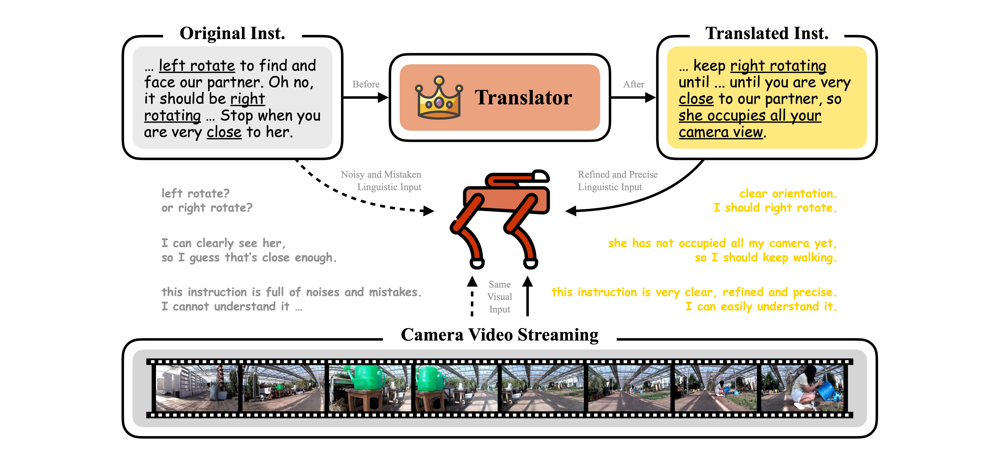

<h1>T-araVLN: Translator for Agricultural Robotic Agents on Vision-and-Language Navigation</h1>

[Xiaobei Zhao](https://github.com/AlexTraveling), [Xingqi Lyu](https://github.com/AlexTraveling), [Xiang Li](https://faculty.cau.edu.cn/lx_7543/),

**[China Agricultural University](https://ciee.cau.edu.cn)**

## Target Issue
Agricultural robotic agents have been becoming powerful helpers in a wide range of agricultural tasks, however, still heavily rely on manual operation or fixed railways for movement. To address this limitation, the AgriVLN method and the A2A benchmark pioneeringly extend Vision-and-Language Navigation (VLN) to the agricultural domain, enabling agents to navigate to the target positions following the natural language instructions. AgriVLN effectively understands the simple instructions, but often misunderstands the complex ones.

## Our Method
We propose the method of Translator for Agricultural Robotic Agents on Vision-and-Language Navigation (T-araVLN), in which the Instruction Translator module translates the original instruction to be more refined and precise. When evaluated on the A2A benchmark, our T-araVLN effectively improves Success Rate from 0.47 to 0.63 and reduces Navigation Error from 2.91m to 2.28m, demonstrating the state-of-the-art performance in the agricultural domain.

## Quick Start
The prompt of Instruction Translator is available now. The complete codes of T-araVLN will be available after the paper is accepted.