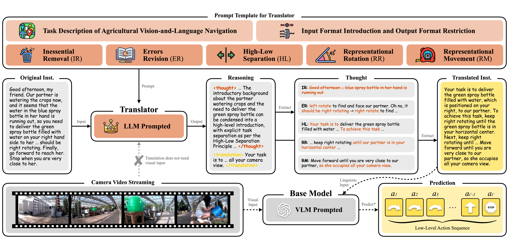

<div align="center">
<h1>T-araVLN: Translator for Agricultural Robotic Agents on Vision-and-Language Navigation</h1>
<a href="https://arxiv.org/abs/2509.06644"></a>

[Xiaobei Zhao](https://github.com/AlexTraveling), [Xingqi Lyu](https://github.com/AlexTraveling), [Xiang Li](https://faculty.cau.edu.cn/lx_7543/)

**[China Agricultural University](https://ciee.cau.edu.cn)**

xiaobeizhao2002@163.com, lxq99725@163.com, cqlixiang@cau.edu.cn


</div>

## Updates
- [October 17th, 2025] We open-source the complete code of the T-araVLN method, and provide the corresponding guidance to set up.
- [October 2nd, 2025] We open-source the code of the instruction translator module.
- [September 18th, 2025] The paper “T-araVLN: Translator for Agricultural Robotic Agents on Vision-and-Language Navigation” is available for reading on [arXiv](https://arxiv.org/abs/2509.06644).

## Overview
Agricultural robotic agents have been becoming powerful helpers in a wide range of agricultural tasks, however, still heavily rely on manual operation or fixed railways for movement. To address this limitation, the AgriVLN method and the A2A benchmark pioneeringly extend Vision-and-Language Navigation (VLN) to the agricultural domain, enabling agents to navigate to the target positions following the natural language instructions. AgriVLN effectively understands the simple instructions, but often misunderstands the complex ones.

We propose the method of Translator for Agricultural Robotic Agents on Vision-and-Language Navigation (T-araVLN), in which the Instruction Translator module translates the original instruction to be more refined and precise. When evaluated on the A2A benchmark, our T-araVLN effectively improves Success Rate from 0.47 to 0.63 and reduces Navigation Error from 2.91m to 2.28m, demonstrating the state-of-the-art performance in the agricultural domain.



## Quick Start
Download the source code of the T-araVLN method.
```bash
git clone git@github.com:AlexTraveling/T-araVLN.git
cd T-araVLN-main
```
Create a new conda environment, then install all the dependent packages.
```bash
conda create -n T-araVLN python=3.11
conda activate T-araVLN
pip install -r requirements.txt
```
Open the home.py file to replace your API and API key.
```python
client = OpenAI(api_key=get_api_key(place), base_url="replace_by_your_api")
```
```python
def get_api_key(place):
   api_key_house = {
      "farm": "replace_by_your_api_key_1",
      "greenhouse": "replace_by_your_api_key_2",
      "forest": "replace_by_your_api_key_3",
      "mountain": "replace_by_your_api_key_4",
      "garden": "replace_by_your_api_key_5",
      "village": "replace_by_your_api_key_6"
   }
   if place not in api_key_house:
      raise ValueError(f"[Error] Unknown scene: {place}")
   else:
      api_key = api_key_house[place]
      return api_key
```
Run the home.py file to start the T-araVLN method, in which all the six place classifications are available: farm, greenhouse, forest, mountain, garden and village.
```bash
python home.py --place farm
```
The running results will be shown in terminal and saved in local.

## Citation
```bibtex
@inproceedings{T-araVLN,
  title={T-araVLN: Translator for Agricultural Robotic Agents on Vision-and-Language Navigation},
  author={Xiaobei Zhao and Xingqi Lyu and Xiang Li},
  booktitle={arXiv:2509.06644},
  year={2025}
}
```