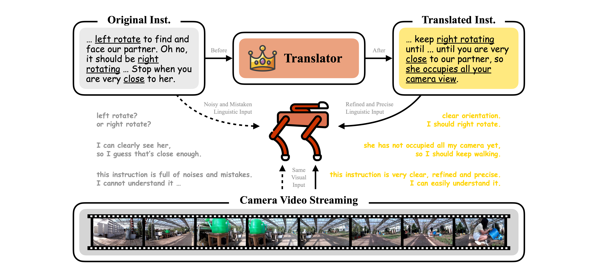
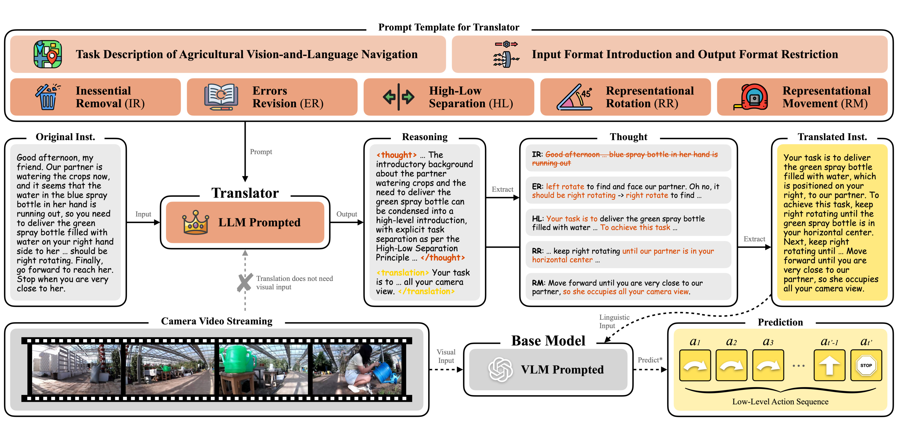

<div align="center">
<h1>T-araVLN: Translator for Agricultural Robotic Agents on Vision-and-Language Navigation</h1>

<p>
  <a href="https://arxiv.org/abs/2509.06644"></a>
  <a href="LICENSE"></a>
</p>

[Xiaobei Zhao](https://github.com/AlexTraveling) · Xingqi Lyu · [Xin Chen](https://faculty.cau.edu.cn/cx/)<sup>✉️</sup> · [Xiang Li](https://faculty.cau.edu.cn/lx_7543/)<sup>✉️</sup>

**[China Agricultural University](https://ciee.cau.edu.cn)**

xiaobeizhao2002@163.com, lxq99725@163.com, chxin@cau.edu.cn, cqlixiang@cau.edu.cn



*“Best love to T-ara, the K-pop group accompanying me to grow up.”*
</div>

## Updates
- [March 26th, 2026] We add more details in our paper “T-araVLN: Translator for Agricultural Robotic Agents on Vision-and-Language Navigation”, which is available for reading on [arXiv](https://arxiv.org/abs/2509.06644).
- [October 17th, 2025] We open-source the complete code of the T-araVLN method, and provide the corresponding guidance to set up.
- [October 2nd, 2025] We open-source the code of the instruction translator module.
- [September 18th, 2025] The paper “T-araVLN: Translator for Agricultural Robotic Agents on Vision-and-Language Navigation” is available for reading on [arXiv](https://arxiv.org/abs/2509.06644).

## Overview
Agricultural robotic agents have been becoming useful helpers in a wide range of agricultural tasks. However, they still heavily rely on manual operations or fixed railways for movement. To address this limitation, the AgriVLN method and the A2A benchmark pioneeringly extend Vision-and-Language Navigation (VLN) to the agricultural domain, enabling agents to navigate to the target positions following the natural language instructions. We observe that AgriVLN can effectively understands the simple instructions, but often misunderstands the complex ones.

To bridge this gap, we propose the T-araVLN method, in which we build the instruction translator module to translate noisy and mistaken instructions into refined and precise representations. When evaluated on A2A, our T-araVLN successfully improves Success Rate (SR) from 0.47 to 0.63 and reduces Navigation Error (NE) from 2.91m to 2.28m, demonstrating the state-of-the-art performance in the agricultural VLN domain.



## Quick Start
Download the source code of the T-araVLN method.
```bash
git clone git@github.com:AlexTraveling/T-araVLN.git
cd T-araVLN-main
```
Create a new conda environment, then install all the dependent packages.
```bash
conda create -n T-araVLN python=3.11
conda activate T-araVLN
pip install -r requirements.txt
```
Open the home.py file to replace your API and API key.
```python
client = OpenAI(api_key=get_api_key(place), base_url="replace_by_your_api")
```
```python
def get_api_key(place):
   api_key_house = {
      "farm": "replace_by_your_api_key_1",
      "greenhouse": "replace_by_your_api_key_2",
      "forest": "replace_by_your_api_key_3",
      "mountain": "replace_by_your_api_key_4",
      "garden": "replace_by_your_api_key_5",
      "village": "replace_by_your_api_key_6"
   }
   if place not in api_key_house:
      raise ValueError(f"[Error] Unknown scene: {place}")
   else:
      api_key = api_key_house[place]
      return api_key
```
Run the home.py file to start the T-araVLN method, in which all the six place classifications are available: farm, greenhouse, forest, mountain, garden and village.
```bash
python home.py --place farm
```
The running results will be shown in terminal and saved in local.

## Citation
If our paper or method is helpful for your research, welcome you use the following citation:
```bibtex
@inproceedings{T-araVLN,
  title={T-araVLN: Translator for Agricultural Robotic Agents on Vision-and-Language Navigation},
  author={Xiaobei Zhao and Xingqi Lyu and Xin Chen and Xiang Li},
  booktitle={arXiv:2509.06644},
  year={2025}
}
```
